<!--
  ╔══════════════════════════════════════════════════════════════╗
  ║  SETUP: place the /assets folder (quantum-hero.svg,            ║
  ║  capabilities.svg, quantum-divider.svg) in your repo root,     ║
  ║  next to this README.md. The custom SVGs are SMIL-animated     ║
  ║  and animate natively on GitHub. No build step required.       ║
  ╚══════════════════════════════════════════════════════════════╝
-->

<div align="center">

<!-- ░░░ CUSTOM ANIMATED HERO (hosted in your repo) ░░░ -->


<!-- ░░░ TYPING SVG ░░░ -->
<a href="https://github.com/lakshit2234">
  
</a>

<br/>

[](https://github.com/lakshit2234)
[](https://github.com/lakshit2234?tab=followers)
[](mailto:lakshitsaini1098@gmail.com)

<br/>

<a href="mailto:lakshitsaini1098@gmail.com"></a>
<a href="https://linkedin.com/in/lakshit-saini1306"></a>
<a href="https://github.com/lakshit2234"></a>

<br/><br/>

> **`"Designing intelligence — from behavioral trajectories to autonomous agents to the quantum edge."`**
>
> 📍 Pune, India &nbsp;|&nbsp; 🎓 B.Tech CSE (AI/ML) · CGPA 9.1 &nbsp;|&nbsp; 🏆 2× Published Researcher &nbsp;|&nbsp; ⚡ 4× Award Winner

</div>


<!-- ═══════════════ WHO AM I ═══════════════ -->
<div align="center">

## 🧬 &nbsp; W H O &nbsp; A M &nbsp; I

</div>

```python
class LakshitSaini:
    """
    Third-year AI/ML Engineer who doesn't just study intelligence —
    he builds it, publishes it, and ships it to production.
    Now extending the stack into the quantum regime.
    """

    identity   = "AI Engineer × Researcher × Builder"
    university = "DY Patil International University, Pune"
    cgpa       = 9.1 / 10

    current_obsessions = [
        "Hybrid LSTM–Diffusion architectures for human-like synthesis",
        "Agentic LLM systems with multi-agent orchestration",
        "Quantum ML: variational circuits for hybrid quantum-classical models",
        "Quantum Federated Learning: privacy-preserving distributed QML",
        "Speech disfluency detection via self-supervised learning",
        "AI security: prompt injection & adversarial robustness",
    ]

    research_mission = """
        Bridge cutting-edge ML research and real-world production systems —
        and probe what quantum computation adds when classical hits its ceiling.
    """

    superpower = "Turning research ideas into IEEE-quality papers AND live demos"
    fun_fact   = "Built a bot-evasion system so human-like it fooled 100% of detectors 🤫"
```

<br/>

<div align="center">
<table>
<tr>
<td align="center" width="200">
<br/>
<b>2 Publications</b><br/><sub>IEEE · IJSREM</sub>
</td>
<td align="center" width="200">
<br/>
<b>4 Awards</b><br/><sub>National · State · University</sub>
</td>
<td align="center" width="200">
<br/>
<b>6 Projects</b><br/><sub>Research + Production</sub>
</td>
<td align="center" width="200">
<br/>
<b>212,568 Samples</b><br/><sub>Custom behavioral dataset</sub>
</td>
</tr>
</table>
</div>


<!-- ═══════════════ QUANTUM FRONTIER ═══════════════ -->
<div align="center">

## ⚛️ &nbsp; Q U A N T U M &nbsp; F R O N T I E R

*Where classical ML plateaus, I start asking quantum questions.*

</div>

> My newest research direction: pushing machine learning beyond classical limits.
> I'm building intuition and prototypes around **hybrid quantum–classical models** and
> **privacy-preserving distributed learning** — the natural next layer on top of my
> diffusion, agentic, and behavioral-AI work.

<table>
<tr>
<td width="50%" valign="top">

**⚛️ Quantum Machine Learning**
- Variational Quantum Circuits (VQC) as trainable layers
- Quantum kernels & feature maps for classification
- Hybrid quantum–classical autograd pipelines
- Barren-plateau-aware ansatz design

</td>
<td width="50%" valign="top">

**🔐 Quantum Federated Learning**
- Distributed QML across non-IID clients
- Parameter aggregation of quantum circuit weights
- Privacy-preserving training without raw-data sharing
- Bridging my LLM-security focus into quantum trust models

</td>
</tr>
</table>

<div align="center">


<sub>🟣 Active learning & prototyping track — not yet published. Open to research collaboration in this space.</sub>

</div>


<!-- ═══════════════ TECH ARSENAL ═══════════════ -->
<div align="center">

## ⚔️ &nbsp; T E C H &nbsp; A R S E N A L

</div>

<details open>
<summary><b>🧠 &nbsp; AI / ML / Deep Learning</b></summary>
<br/>


</details>

<details open>
<summary><b>🤖 &nbsp; LLM & Agentic AI</b></summary>
<br/>


</details>

<details open>
<summary><b>⚛️ &nbsp; Quantum & Emerging</b></summary>
<br/>


</details>

<details>
<summary><b>💻 &nbsp; Languages, APIs & Infrastructure</b></summary>
<br/>


</details>

<details>
<summary><b>🎯 &nbsp; Computer Vision & Signal Processing</b></summary>
<br/>


</details>


<!-- ═══════════════ FEATURED PROJECTS ═══════════════ -->
<div align="center">

## 🚀 &nbsp; F E A T U R E D &nbsp; P R O J E C T S

*👆 Click any project to expand the details.*

</div>

<details open>
<summary><b>🧠 &nbsp; MIMIC — Hybrid LSTM–Diffusion Trajectory Synthesis</b></summary>

> *The research that didn't just pass academic review — it fooled bot detectors.*

<table>
<tr>
<td width="60%">

**Problem:** Existing motion synthesis models are either too rigid (LSTM) or too noisy (pure diffusion) to produce convincingly human-like behavioral trajectories.

**Innovation:** A hybrid architecture where an LSTM encodes contextual priors that condition a residual DDPM diffusion model — combining sequential memory with stochastic refinement.

**Results:**
- 📊 JSD = **0.1478** (near-perfect human distribution match)
- 📈 Smoothness Index = **0.8593**
- 🛡️ Bot-Detector Evasion = **100%** (vs 0% LSTM-only)
- 📦 Custom dataset: **212,568 samples** across 4 behavioral profiles

</td>
<td width="40%" align="center">


<br/>

**Status:** 📝 IEEE Submission In Progress

<br/>

`Behavioral AI` `Trajectory Synthesis` `Bot Evasion` `Generative Models`

</td>
</tr>
</table>

</details>

<details>
<summary><b>🔍 &nbsp; InsightCrew — Multi-Agent Research & Content Engine</b></summary>

> *Three agents. One goal. Zero manual research.*

<table>
<tr>
<td width="60%">

**Problem:** Research synthesis and content generation require hours of parallel, context-aware work — impossible for a single LLM call.

**Innovation:** A sequential 3-agent CrewAI pipeline (Researcher → Analyst → Writer) powered by Gemini 2.0 + Tavily RAG for real-time web context injection.

**Impact:**
- ♾️ Fully autonomous research-to-content pipeline
- 🌐 Production-deployed on Streamlit Cloud
- ⚡ Real-time RAG via Tavily API

</td>
<td width="40%" align="center">


<br/>

[](https://github.com/lakshit2234/insight-crew)
<!-- 🔧 REPLACE the URL below with your real Streamlit Cloud link -->
[](https://YOUR-INSIGHTCREW-APP.streamlit.app)

`Agentic AI` `Multi-Agent` `RAG` `LLM`

</td>
</tr>
</table>

</details>

<details>
<summary><b>📈 &nbsp; StonkSensei — Agentic LLM Financial Intelligence System</b></summary>

> *Real-time financial intelligence, dual-agent architecture, streaming inference.*

<table>
<tr>
<td width="60%">

**Problem:** Financial analysis requires aggregating real-time data, news, and quantitative reasoning simultaneously — a perfect multi-agent problem.

**Innovation:** Dual-agent phidata system with Groq's `deepseek-r1-distill-llama-70b` for streaming inference, DuckDuckGo + Yahoo Finance as live data tools, served via FastAPI.

**Impact:**
- ⚡ Low-latency streaming LLM responses
- 📡 Live market + news data integration
- 🖥️ Interactive agent playground UI

</td>
<td width="40%" align="center">


<br/>

[](https://github.com/lakshit2234/StonkSensei)
<!-- 🔧 REPLACE the URL below with your real deployed link (or delete this line if not deployed) -->
[](https://YOUR-STONKSENSEI-APP-URL)

`Fintech AI` `Streaming LLM` `Agentic`

</td>
</tr>
</table>

</details>

<details>
<summary><b>🗣️ &nbsp; Speech Disfluency Detection & Remediation</b></summary>

> *Fine-tuning self-supervised speech models for clinical-grade stutter detection.*

<table>
<tr>
<td width="60%">

**Problem:** Automated disfluency detection for real-world accessibility systems requires robustness across noise conditions and accurate classification of subtle speech patterns.

**Innovation:** Fine-tuned Wav2Vec 2.0 on SEP-28k for 5-class disfluency detection + a Whisper-aligned remediation pipeline with acoustic robustness validation.

**Results:**
- 🎯 WER < **0.15** (Whisper-aligned)
- 🔊 Validated across **5–25 dB SNR** noise conditions
- 🏥 5 stutter categories classified

</td>
<td width="40%" align="center">


<br/>

**Status:** 🔬 Active Research

`Speech ML` `Accessibility` `Self-Supervised`

</td>
</tr>
</table>

</details>

<details>
<summary><b>🤟 &nbsp; SignSpeakAI — Real-Time Sign–Speech Translation</b></summary>

> *Making communication barrier-free with multimodal AI.*

<table>
<tr>
<td width="60%">

**Innovation:** Bidirectional multimodal pipeline — MediaPipe + LSTM for Sign-to-Speech, and a Speech-to-Sign TTS module — with multilingual support and modular CV/NLP architecture.

**Impact:** Real-time, low-latency accessible HCI interaction across multiple languages.

</td>
<td width="40%" align="center">


`HCI` `Accessibility` `Multimodal AI`

</td>
</tr>
</table>

</details>

<details>
<summary><b>🛰️ &nbsp; INR-AD — Anomaly Detection via Implicit Neural Representations</b></summary>

> *SIREN networks meet satellite telemetry.*

[](https://github.com/lakshit2234/INR-AD)

Unsupervised anomaly scoring on SMAP satellite telemetry using a SIREN architecture (implicit neural representations). Fully modular, reproducible codebase with benchmarked results.

`SIREN` `Anomaly Detection` `Satellite Telemetry` `Unsupervised Learning`

</details>


<!-- ═══════════════ RESEARCH & PUBLICATIONS ═══════════════ -->
<div align="center">

## 📄 &nbsp; R E S E A R C H &nbsp; & &nbsp; P U B L I C A T I O N S

</div>

<table>
<tr>
<td width="5%" align="center">📘</td>
<td>

**Exploring the Landscape of AI Security: A Taxonomy Review on Prompt Injection and Jailbreaking**

*NCTAAI 4.0 National Conference Proceedings · May 2025*

A systematic taxonomy of prompt injection and jailbreaking attack mechanisms across large language models, analyzing adversarial implications for AI safety in Industry 4.0 contexts — cybersecurity and autonomous systems.


</td>
</tr>
<tr>
<td align="center">📗</td>
<td>

**Enhancing Predictive Maintenance in Smart Home Devices using AI/ML on Microcontrollers**

*International Journal of Scientific Research in Engineering and Management (IJSREM) · October 2024*

On-device ML deployment for real-time fault detection in resource-constrained IoT microcontrollers, reducing cloud inference dependency with edge AI methodology.


</td>
</tr>
<tr>
<td align="center">📙</td>
<td>

**MIMIC: Hybrid LSTM–Diffusion Model for Human-Like Mouse Trajectory Synthesis** *(Under Submission)*

Hybrid LSTM prior + conditional residual DDPM for context-aware behavioral trajectory generation. JSD = 0.1478, 100% bot-evasion rate. Targeting IEEE Transactions on Biometrics, Behavior and Identity Science.


</td>
</tr>
</table>

<div align="center">

**Research Interests**

`LLM Security & Adversarial AI` · `Generative Models` · `Speech ML` · `Behavioral Biometrics`
`Agentic Systems` · `Quantum ML & Quantum FL` · `Edge AI / TinyML` · `Implicit Neural Representations`

</div>


<!-- ═══════════════ ACHIEVEMENTS ═══════════════ -->
<div align="center">

## 🏆 &nbsp; A C H I E V E M E N T S &nbsp; W A L L

<br/>


</div>

<div align="center">

| 🥇 | Achievement | Issuer | Year |
|:---:|:---|:---|:---:|
| 🎓 | **Academic Excellence Scholarship** | DY Patil International University | 2026 |
| 🏆 | **1st Rank — Ideathon 2025** | DY Patil International University | Nov 2025 |
| 📜 | **Research Paper Award** | NCTAAI 4.0 · ICEM National Conference | Mar 2025 |
| 🥇 | **1st Rank — State-Level Research Paper Competition** | MITACSC | Dec 2024 |

</div>


<!-- ═══════════════ GITHUB ANALYTICS ═══════════════ -->
<div align="center">

## 📊 &nbsp; G I T H U B &nbsp; A N A L Y T I C S

<br/>

<!-- ░░░ Rotating dev quote — changes on every refresh ░░░ -->


<br/><br/>


<br/><br/>


<br/><br/>

<picture>
  <source media="(prefers-color-scheme: dark)" srcset="https://raw.githubusercontent.com/lakshit2234/lakshit2234/output/github-snake-dark.svg" />
  <source media="(prefers-color-scheme: light)" srcset="https://raw.githubusercontent.com/lakshit2234/lakshit2234/output/github-snake.svg" />
  
</picture>

</div>

<br/>

<details>
<summary><b>⚡ &nbsp; Recent Activity</b> &nbsp;<sub>(auto-updates daily via GitHub Actions)</sub></summary>

<!--START_SECTION:activity-->
1. 💪 Opened PR [#31544](https://github.com/numpy/numpy/pull/31544) in [numpy/numpy](https://github.com/numpy/numpy)
<!--END_SECTION:activity-->

</details>


<!-- ═══════════════ CAREER TIMELINE ═══════════════ -->
<div align="center">

## 🕰️ &nbsp; C A R E E R &nbsp; T I M E L I N E

</div>

```
2023 ──────────────────────────────────────────────────────────────── 2027
  │
  ├─── Aug 2023 ──▶  🎓  B.Tech CSE (AI/ML) · DY Patil International University
  ├─── Oct 2024 ──▶  📗  Published: Predictive Maintenance on Microcontrollers · IJSREM
  ├─── Dec 2024 ──▶  🥇  1st Rank · State-Level Research Paper · MITACSC
  ├─── Mar 2025 ──▶  📘  Research Paper Award · NCTAAI 4.0 · ICEM
  ├─── Feb–May 2025 ▶  🤟  SignSpeakAI · Multimodal Sign–Speech Translation
  ├─── May 2025 ──▶  🤖  InsightCrew · Multi-Agent Research Engine (Production)
  ├─── May 2025 ──▶  💼  Software Engineering Intern · Dexpert Systems Pvt. Ltd.
  ├─── May 2025 ──▶  📈  StonkSensei · Agentic Financial Intelligence System
  ├─── Nov 2025 ──▶  🧠  MIMIC Research Started · Hybrid LSTM-Diffusion
  ├─── Nov 2025 ──▶  🏆  1st Rank Ideathon 2025 · DY Patil International University
  ├─── Jan 2026 ──▶  ✅  MIMIC Complete · JSD=0.1478 · 100% Bot Evasion
  ├─── Jan 2026 ──▶  🗣️  Speech Disfluency Detection Research · Active
  ├─── 2026 ─────▶  ⚛️  Quantum ML & Quantum FL · Exploration Track Begun
  ├─── 2026 ─────▶  🎓  Academic Excellence Scholarship · DY Patil International University
  └─── 2027 ─────▶  🚀  B.Tech Graduation · Ready to build the future
```


<!-- ═══════════════ CURRENT FOCUS ═══════════════ -->
<div align="center">

## 🎯 &nbsp; C U R R E N T &nbsp; F O C U S

</div>

<table>
<tr>
<td width="50%" valign="top">

**🚀 Currently Building**
- Speech Disfluency Detection with real-time remediation
- MIMIC IEEE paper finalization & journal submission
- First quantum ML prototypes (VQC classifiers)

**📚 Researching**
- Diffusion architectures for controllable generation
- LLM safety: adversarial prompt attacks & defenses
- Self-supervised speech representation learning

</td>
<td width="50%" valign="top">

**🎯 Currently Learning**
- Quantum ML & Quantum Federated Learning
- Advanced multi-agent orchestration patterns
- Reinforcement Learning for agentic decision-making

**🤝 Open to Collaborate On**
- ML Research (IEEE-level publications)
- Agentic AI / LLM Systems & Quantum ML
- AI for Healthcare, Accessibility, or Security
- Hackathons & Research Internships

</td>
</tr>
</table>


<!-- ═══════════════ DEVELOPER DNA ═══════════════ -->
<div align="center">

## 🧬 &nbsp; D E V E L O P E R &nbsp; D N A

*A machine-learning model trained on curiosity and caffeine.*

<br/>

<!-- ░░░ CUSTOM ANIMATED CAPABILITY BARS (hosted in your repo) ░░░ -->


</div>

```yaml
Model Architecture: Lakshit-v3.2-Researcher-Builder

Training Data:
  - 2+ years of AI/ML coursework & self-study
  - 212,568 custom behavioral motion samples (self-collected)
  - 2 published research papers
  - 6 production/research projects shipped

Activation Functions:
  - Curiosity-driven exploration
  - Research-first problem solving
  - Production-grade output standards

Loss Function:   Cross-entropy between "what exists" and "what should exist"
Optimizer:       Gradient descent on impact
Regularization:  Academic rigor + real-world validation
Next Layer:      Quantum-classical hybrid (training...)

Status: 🟢 TRAINING IN PROGRESS — Expected convergence: Aug 2027
```


<!-- ═══════════════ CONTACT ═══════════════ -->
<div align="center">

## 📡 &nbsp; L E T ' S &nbsp; B U I L D &nbsp; S O M E T H I N G

<br/>

> *Whether you're a researcher, recruiter, founder, or fellow builder —*
> *if you're working on something that matters, I want to talk.*

<br/>

[](mailto:lakshitsaini1098@gmail.com)
[](https://linkedin.com/in/lakshit-saini1306)
[](https://github.com/lakshit2234)

<br/>

**Currently open to:**

`Research Internships` &nbsp; `IEEE Co-authorship` &nbsp; `AI/ML Roles` &nbsp; `Quantum ML Collabs` &nbsp; `Hackathon Teams` &nbsp; `Grad School`

<br/><br/>


</div>

<!-- ─────────────────────────────────────────── -->
<!-- README crafted with research-grade precision -->
<!-- Custom SVG animations · Quantum-themed identity -->
<!-- Last updated: 2026                           -->
<!-- ─────────────────────────────────────────── -->